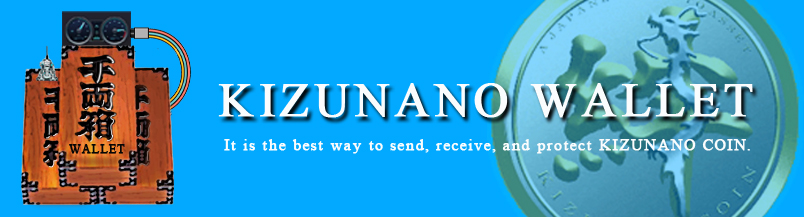

    

# KIZUNANO WALLET

KIZUNANO WALLET is a fork of the popular Nano wallet [Nault](https://github.com/Nault/Nault) 💙

It's a fully client-side signing wallet for sending and receiving [KIZUNANO COIN](https://github.com/kizunanocoin/node) either directly in your browser at [wallet.kizunanocoin.com](https://wallet.kizunanocoin.com).

Seamless integration with any KIZUNANO COIN compatible RPC backend/websocket and the aim to be more frequently maintained are some of the main features. Those together will greatly increase the stability, performance and uptime.

___

## How To Use

You can use KIZUNANO WALLET from any device on the web at [wallet.kizunanocoin.com](https://wallet.kizunanocoin.com).

Both the app and web (recommended) version supports the Ledger Nano hardware wallet. For help using it, please refer to [this guide](https://docs.nault.cc/2020/08/04/ledger-guide.html).

## How To Help

Thanks for your interest in contributing! There are many ways to contribute to this project. [Get started here at CONTRIBUTING.md](CONTRIBUTING.md).

If you want to know how to setup the development environment head over to [DEVELOPMENT.md](DEVELOPMENT.md).

## Support

If you are looking for more interactive and quick support compared to creating a new Github issue, you will then find most of the developers in the Nault channel over at the [discord server](https://chat.kizunanocoin.com/).

## Acknowledgements

Special thanks to the following!

- [Nault](https://github.com/Nault/Nault) - The original one
- [numtel/nano-webgl-pow](https://github.com/numtel/nano-webgl-pow) - WebGL PoW Implementation
- [jaimehgb/RaiBlocksWebAssemblyPoW](https://github.com/jaimehgb/RaiBlocksWebAssemblyPoW) - CPU PoW Implementation
- [dcposch/blakejs](https://github.com/dcposch/blakejs) - Blake2b Implementation
- [dchest/tweetnacl-js](https://github.com/dchest/tweetnacl-js) - Cryptography Implementation

## Donations

If you have found KIZUNANO WALLET useful and are feeling generous, you can donate at
`kizn_1tahs8wx5xupc47kxna6dgn3m1jfiaxf5b3oz5dbbmk8cxi5sxjok7a5ta4k`

Thanks a lot!
